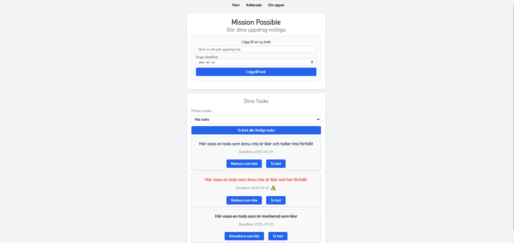
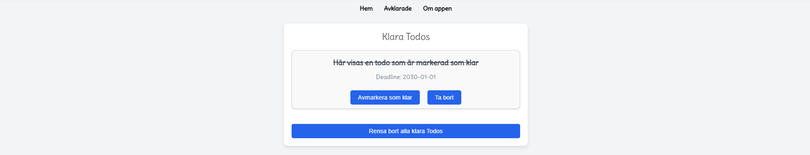
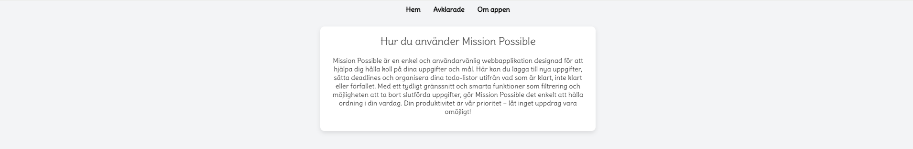
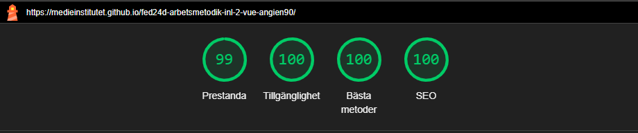
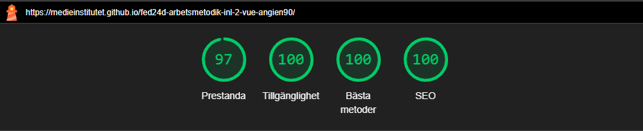

# Todo app

Det här var vårt första projekt i Vue under utbildningen. Uppgiften var att skapa en enkel Todo-app med ett input-fält och en knapp för att lägga till todos i en lista. Varje todo skulle kunna markeras som avklarad och på något sätt indikera att den var slutförd.

Vi implementerade även stöd för LocalStorage, vilket gör att den skapade todo-listan sparas och finns kvar även om sidan uppdateras. Detta bidrar till en bättre användarupplevelse genom att förhindra att användarens data försvinner vid omladdning.

## Författare

[@angien90](https://github.com/angien90)

## Screenshots på projektet

  

#### Lighthouse analys

 

## Tech Stack


## Badges


## Installationer

För att öppna och köra detta Vue-projekt på en annan dator behöver du vanligtvis göra följande inställningar och steg:

```
1. Installera Node.js och npm
Ladda ner och installera Node.js om det inte redan finns på datorn. npm (Node Package Manager) installeras automatiskt med Node.js.

2. Ladda ner projektet
Klona projektet från en Git-repository eller kopiera projektmappen till den nya datorn.

3. Installera projektets beroenden
Öppna terminalen och navigera till projektets mapp.
Kör kommandot:
npm install
Detta installerar alla beroenden som finns angivna i projektets package.json.

4. Starta utvecklingsservern
Kör följande kommando för att starta projektet:
npm run dev
```
